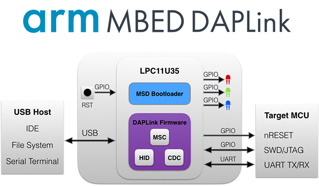
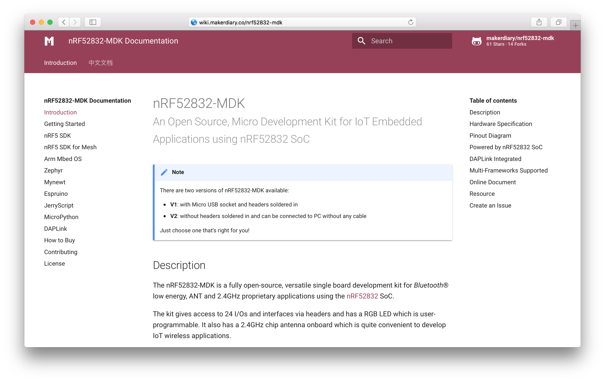

# nRF52832-MDK  <small>开源、面向物联网应用的开发套件</small>

!!! note "提示"
    目前 nRF52832-MDK 有两个硬件版本可用：

    * **V1**: 带有 Micro USB 接口且排针焊接在板上
    * **V2**: 配排针但不焊在板上、无需数据线即可与 PC 连接

nRF52832-MDK 是一款完全开源、基于 Nordic 新一代高性能低功耗蓝牙系统级芯片 [nRF52832](http://www.nordicsemi.com/eng/Products/Bluetooth-low-energy/nRF52832)、面向物联网嵌入式应用的开发套件。

nRF52832-MDK 提供丰富的硬件资源，集成多功能调试工具，可以玩转多种开源软件框架（如：nRF5 SDK, Mesh, Mbed OS 5, Zephyr, Mynewt, JerryScript, Espruino, MicroPython 等等）。

nRF52832-MDK 支持跨平台开发，并且提供丰富的在线文档及示例，希望带来全新的开发体验。

## 硬件规格

* Nordic 高性能低功耗蓝牙 SoC nRF52832 

	* ARM® Cortex™-M4F 内核
	* 512kB Flash + 64kB RAM
	* 支持低功耗蓝牙(BLE), ANT, 2.4GHz
	* 支持 NFC™-A 标签

* 板载 DAPLink 多功能调试工具：

	* MSC - 支持“拖放”方式下载固件
	* CDC - 提供虚拟串口工具
	* HID - 兼容 CMSIS-DAP 仿真功能

* 拥有多达 24 个可编程 GPIO

* 提供复位按钮，可更新 DAPLink 固件

* 可编程 RGB LED

* 2.4GHz 晶片天线，在有限的空间内提供出色的 RF 性能

* 3.3V 稳压器，高效率、低静态电流、可输出 1A 峰值电流

* VBUS & VIN 电源路径管理

* 标准引脚间距，可直接安装在面包板上

* 尺寸小巧 48mm x 18mm x 13mm (已焊排针)、63mm x 18mm x 4mm（不焊排针）

## 引脚位置图

## nRF52832 SoC

nRF52832 SoC 是 Nordic Semiconductor 新一代高性能的低功耗蓝牙系统级芯片，ARM® Cortex™-M4F 内核，512kB Flash + 64kB RAM，支持 BLE, ANT, 2.4GHz 协议栈。

<a href="http://www.nordicsemi.com/eng/Products/Bluetooth-low-energy/nRF52832"><button data-md-color-primary="indigo">更多信息</button></a>

## 多功能调试器

nRF52832-MDK 集成了多功能调试器 DAPLink，即插即用，支持“拖放”方式下载固件、串口调试、CMSIS-DAP 仿真调试。

<a href="https://github.com/ARMmbed/DAPLink"><button data-md-color-primary="indigo">ARMmbed/DAPLink</button></a>

## 开源软件框架

nRF52832-MDK 可以用来玩转多种开源软件框架：

| 开源框架  | 简介 |
| ---------- | ----- |
| [nRF5 SDK](http://www.nordicsemi.com/eng/Products/Bluetooth-low-energy/nRF5-SDK) | Nordic 官方提供的 SDK |
| [nRF5 SDK for Mesh](http://www.nordicsemi.com/eng/Products/Bluetooth-low-energy/nRF5-SDK-for-Mesh) | Nordic 官方提供的低功耗蓝牙 Mesh 网络 SDK |
| [Mbed OS 5](https://os.mbed.com/) | Arm 开源的物联网实时操作系统 |
| [Zephyr](https://www.zephyrproject.org/) | Linux 基金会开源的物联网实时操作系统 |
| [Mynewt](https://mynewt.apache.org/) | Apache 开源模块化的实时操作系统，专门为内存和存储都极其有限而又要以极低功耗运行非常长时间的物联网设备设计 |
| [JerryScript](https://github.com/jerryscript-project/jerryscript) | 三星开源的面向物联网的轻量级 JavaScript 引擎 |
| [Espruino](https://github.com/espruino/Espruino) | 运行在内存和存储都极其有限的 MCU 上的 JavaScrupt 引擎 |
| [MicroPython](https://github.com/micropython/micropython) | 面向嵌入式设备的轻量级 Python |
| [Web Bluetooth](https://github.com/WebBluetoothCG/web-bluetooth) | 基于 Web 的低功耗蓝牙 API |
| [Eddystone](https://github.com/google/eddystone) | Google 开源的 Beacon 协议 |
| .... | |

## 在线文档

nRF52832-MDK 提供优秀的在线文档，使用 [MkDocs](http://www.mkdocs.org/) 生成文档，并托管在 [GitHub](https://github.com/makerdiary/nrf52832-mdk/) 上。

## 相关资源

| 版本      | 设计文档   |
| -------- | --------- |
| V2.0     | [nRF52832-MDK V2.0 Schematic](../hardware/nRF52832-MDK_SCH_V2.0.pdf) [nRF52832-MDK V2.0 PCB](../hardware/nRF52832-MDK_PCB_V2.0.pdf) [nRF52832-MDK V2.0 3D STEP](../hardware/nRF52832-MDK_3D_STEP_V2.0.step)|
| V1.1     | [nRF52832-MDK V1.1 Schematic](../hardware/nRF52832-MDK_SCH_V1.1.pdf) [nRF52832-MDK V1.1 PCB]() [nRF52832-MDK V1.1 3D STEP](../hardware/nRF52832-MDK_3D_STEP_V1.1.step)|
| V1.0     | [nRF52832-MDK V1.0 Schematic](../hardware/nRF52832-MDK_SCH_V1.0.pdf) [nRF52832-MDK V1.0 PCB](../hardware/nRF52832-MDK_PCB_V1.0.pdf) [nRF52832-MDK V1.0 3D STEP](../hardware/nRF52832-MDK_3D_STEP_V1.0.step)|

## 问题反馈

如果在开发过程遇到任何问题，可以通过 [GitHub Issue](https://github.com/makerdiary/nrf52832-mdk/issues) 或 [Slack](https://join.slack.com/t/makerdiary/shared_invite/enQtMzIxNTA4MjkwMjc2LTM5MzcyNDhjYjI3YjEwOWE1YzM3YmE0YWEzNGNkNDU3NmE5M2M0MWYyM2QzZTFkNzQ2YjdmMWJlZjIwYmQwMDk) 反馈。

<a href="https://github.com/makerdiary/nrf52832-mdk/issues/new"><button data-md-color-primary="indigo"><i class="fa fa-github"></i> 创建 Issue</button></a>

<a href="https://join.slack.com/t/makerdiary/shared_invite/enQtMzIxNTA4MjkwMjc2LTM5MzcyNDhjYjI3YjEwOWE1YzM3YmE0YWEzNGNkNDU3NmE5M2M0MWYyM2QzZTFkNzQ2YjdmMWJlZjIwYmQwMDk"><button data-md-color-primary="red"><i class="fa fa-slack"></i> 加入 Slack</button></a>

