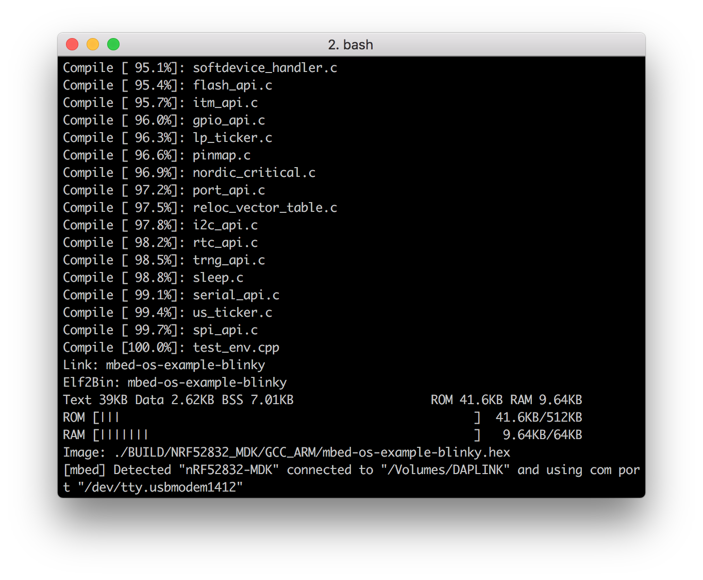
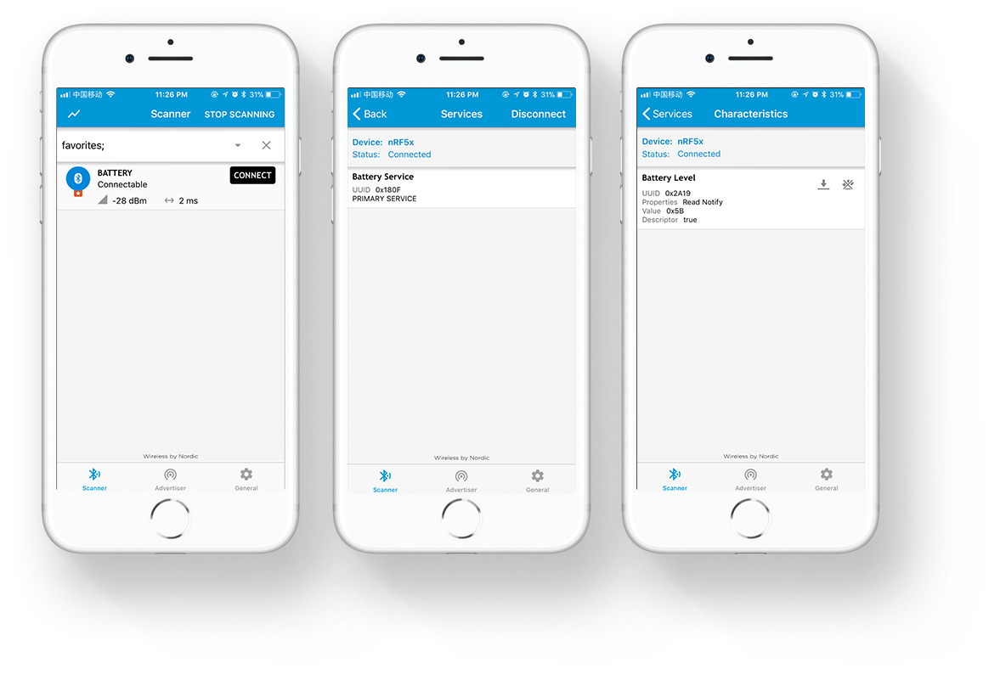

# Arm Mbed OS <br><small>Arm 开源、面向物联网小型设备的实时操作系统</small>

[](https://os.mbed.com/)

## 简介

Arm Mbed OS 是 Arm 专门为物联网设备而设计的开源嵌入式操作系统，主要面向 ARM Cortex-M 系列微控制器，非常适合涉及智能城市、智能家庭和穿戴式设备等领域的应用程序。

相比于其他嵌入式操作系统，Arm Mbed OS 的主要优势在于：

* 安全性：提供 mbed TLS 和 mbed uVisor 安全机制
* 连接性：支持多种协议栈，包括 Bluetooth LE, Wi-Fi, 6LoWPAN, Thread, Lora等等
* 完整的工具链支持：提供在线 IDE, mbed CLI 以及 第三方 IDE
* 良好的社区生态

了解更多内容，可以直接访问 [Mbed OS 开发者网站](https://os.mbed.com/).

## 使用 Arm Mbed CLI

Arm 为 Mbed OS 提供了离线开发工具 Mbed CLI，该工具支持跨平台，可以运行在 Windows，Linux 和 macOS 平台上。

### 安装 Mbed CLI

在 Windows 上，最简单的方法是使用 [Mbed CLI Windows .exe 安装包](https://mbed-media.mbed.com/filer_public/50/38/5038849b-16a8-42f3-be7a-43d98c7a3af3/mbed_installer_v043.exe)。

在 Linux 和 macOS系统，可以使用 `pip` 进行安装：

``` sh
$ pip install mbed-cli
```

安装完成后，可以使用 `mbed help` 验证是否正确安装。

### 设置开发环境

接着，需要添加工具链路径配置：

``` sh
$ mbed config -G GCC_ARM_PATH "<path to GNU Arm bin>"
[mbed] <path to GNU Arm bin> now set as global GCC_ARM_PATH

$ mbed config --list
[mbed] Global config:
GCC_ARM_PATH=<path to GNU Arm bin>
```

## 编译运行第一个示例

现在可以开始尝试编译第一个示例，这里以 `mbed-os-example-blinky` 为例：

打开命令行终端，切换到示例目录：

``` sh
$ cd ./nrf52832-mdk/examples/mbedos5/mbed-os-example-blinky/
```

为该示例添加 Mbed OS 库：

``` sh
mbed-os-example-blinky$ mbed config root .
mbed-os-example-blinky$ mbed add https://github.com/makerdiary/mbed-os.git
```

使用 `mbed compile` 进行编译：

``` sh
mbed-os-example-blinky$ mbed compile --target NRF52832_MDK --toolchain GCC_ARM --flash
```

增加 `--flash` 参数，将会在编译完成后自动将固件下载到 nRF52832-MDK 硬件上。

如果 `mbed detect` 无法检测到板子，可以运行以下命令添加：

``` sh
$ mbedls --mock=1024:nRF52832_MDK
```

!!! tip "提示"
    你也可以参考前面的内容 “[如何下载固件？](../getting-started/#_2)” 下载固件。



观察运行结果：


## 低功耗蓝牙示例

Mbed OS 对低功耗蓝牙支持非常友好，这里提供一些低功耗蓝牙示例：

``` sh
./nrf52832-mdk/examples/mbedos5/mbed-os-example-ble
├── BLE_BatteryLevel
├── BLE_Beacon
├── BLE_Button
├── BLE_EddystoneObserver
├── BLE_EddystoneService
├── BLE_GAPButton
├── BLE_HeartRate
├── BLE_LED
├── BLE_LEDBlinker
├── BLE_Thermometer
└── README.md
```

可以切换到示例目录，例如，`BLE_BatteryLevel`:

``` sh
$ cd BLE_BatteryLevel
```

添加 Mbed OS 库：

``` sh
BLE_BatteryLevel$ mbed add https://github.com/makerdiary/mbed-os.git
```

编译下载：

``` sh
BLE_BatteryLevel$ mbed compile --target NRF52832_MDK --toolchain GCC_ARM --flash
```

打开 **nRF Connect** app，找到名为 `BATTERY` 的设备，连接设备，可发现 UUID 为 `0x180F` 的电池服务，该服务包含 UUID 为 `0x2A19` 的 `Battery level` 属性。

[](../../mbedos/images/mbed-os-example-ble-battery.jpg)

其他低功耗蓝牙示例使用方法类似，你可以自行验证。

## 更多示例

我们会不定期增加更多有趣的示例到 [nrf52832-mdk](https://github.com/makerdiary/nrf52832-mdk) 仓库中，敬请关注！

## 参考资源

* [Arm Mbed OS 开发者网站](https://os.mbed.com/)
* [Mbed OS 文档中心](https://os.mbed.com/docs/)
* [ARMmbed/mbed-os 仓库](https://github.com/ARMmbed/mbed-os)

## 问题反馈

如果在开发过程遇到任何问题，可以通过 [GitHub Issue](https://github.com/makerdiary/nrf52832-mdk/issues) 反馈。

<a href="https://github.com/makerdiary/nrf52832-mdk/issues/new"><button data-md-color-primary="marsala"><i class="fa fa-github"></i> 创建 Issue</button></a>

