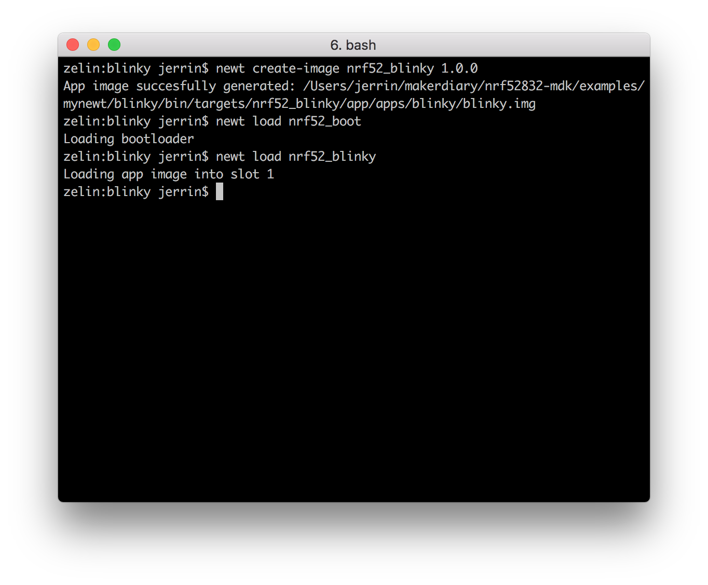
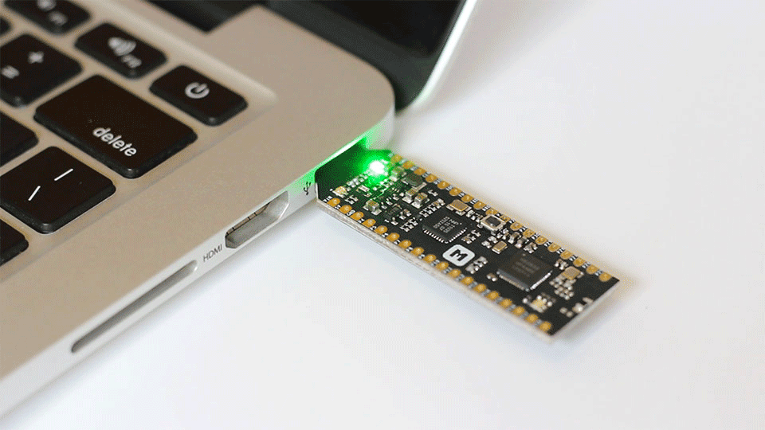

# Mynewt <br><small>Apache 开源、适用于微型嵌入式设备的组件化实时操作系统</small>

## 简介

Mynewt 是一款适用于微型嵌入式设备的组件化开源操作系统。Apache Mynewt 使用 Newt 构建和包管理系统，它允许开发者仅选择所需的组件来构建操作系统。其目标是使功耗和成本成为驱动因素的微控制器环境的应用开发变得容易。

Mynewt 提供开源蓝牙 5.0 协议栈和嵌入式中间件、闪存文件系统、网络堆栈、引导程序、FATFS、引导程序、统计和记录基础设施等的支持。

## 安装 Newt

为了是开发者能够更好地使用 Mynewt 提供的组件来开发应用，Mynewt 引入了一个名为 `newt` 的构建工具和包管理器。该工具支持跨平台，可以运行在 Windows，Linux 和 macOS 平台上。

下面将介绍在不同平台上如何安装 `newt`：

### Windows

在 Windows 平台，最简单的方式是安装一个 Unix 开发环境，例如 [MSYS2](http://www.msys2.org/)。你可以按照以下步骤进行配置：

1. 前往 [MSYS2](http://www.msys2.org/) 官网下载软件并安装（64 位系统选择 "x86_64"，32 位系统选择 "i686"）；

2. 打开 MSYS2，更新系统软件包：

	``` sh
	$ pacman -Syu
	```

3. 如果需要的话，关闭 MSYS2，重新运行以完成更新：

	``` sh
	$ pacman -Su
	```

4. 安装 `git` 和 `tar` 工具:

	``` sh
	$ pacman -S git tar
	```

5. 下载并解压 newt 源码：

	``` sh
	$ wget -P /tmp https://github.com/apache/mynewt-newt/archive/mynewt_1_3_0_tag.tar.gz
	$ tar -xzf /tmp/mynewt_1_3_0_tag.tar.gz
	```

6. 运行 `build.sh` 来编译 `newt` 工具：

	``` sh
	$ cd mynewt-newt-mynewt_1_3_0_tag   
	$ ./build.sh
	$ rm /tmp/mynewt_1_3_0_tag.tar.gz
	```

7. 编译成功后将生成 `newt/newt.exe` 可执行文件，将其移动到系统目录：

	``` sh
	$ mv newt/newt.exe /usr/bin
	```

### macOS

在 macOS 上可以直接使用 [Homebrew](http://brew.sh/) 来安装 newt。如果是第一次安装，需要先运行以下命令：

``` sh
$ brew tap runtimeco/homebrew-mynewt
$ brew update
```

然后安装最新版 `newt` 工具：

``` sh
$ brew update
$ brew install mynewt-newt
```

### Linux

在 Linux 系统（比如 Ubuntu），直接运行以下命令即可安装 newt：

``` sh
$ sudo apt-get update
$ sudo apt-get install newt
```

!!! note
	如果遇到错误 (比如丢失 `sys/mman.h` 文件), 需要先确认已经安装了 32位 `glibc`:
	``` sh
	$ sudo apt-get install gcc-multilib
	```

## 运行第一个示例

安装好 newt 之后就可以尝试编译第一个示例了，我们提供了 `blinky` 示例，你可以按照以下步骤进行验证：

打开命令行终端并切换到 `blinky` 示例目录：

``` sh
$ cd ./nrf52832-mdk/examples/mynewt/blinky
```

使用 `newt install` 命令安装示例依赖项：

``` sh
blinky$ newt install
apache-mynewt-core successfully installed version 1.3.0-none
mynewt_nrf52832_mdk successfully installed version 0.0.0-none
```

该示例已经提供了几个可用的 target，其中 `nrf52_blinky` 为应用程序、`nrf52_boot` 为 Bootloader，可以使用 `newt target show` 命令查看：

``` sh
blinky$ newt target show
targets/my_blinky_sim
    app=apps/blinky
    bsp=@apache-mynewt-core/hw/bsp/native
    build_profile=debug
targets/nrf52_blinky
    app=apps/blinky
    bsp=@mynewt_nrf52832_mdk/hw/bsp/nrf52832_mdk
    build_profile=debug
targets/nrf52_boot
    app=@apache-mynewt-core/apps/boot
    bsp=@mynewt_nrf52832_mdk/hw/bsp/nrf52832_mdk
    build_profile=optimized
```


运行 `newt build nrf52_boot` 命令编译 Bootloader：

``` sh
blinky$ newt build nrf52_boot
Building target targets/nrf52_boot
Compiling repos/apache-mynewt-core/boot/bootutil/src/image_ec.c
Compiling repos/apache-mynewt-core/boot/bootutil/src/image_ec256.c
Compiling repos/apache-mynewt-core/apps/boot/src/boot.c
Compiling repos/apache-mynewt-core/boot/bootutil/src/bootutil_misc.c
Compiling repos/apache-mynewt-core/boot/bootutil/src/image_rsa.c
Compiling repos/apache-mynewt-core/boot/bootutil/src/image_validate.c
Compiling repos/apache-mynewt-core/boot/bootutil/src/loader.c
Compiling repos/apache-mynewt-core/crypto/mbedtls/src/aes.c
Compiling repos/apache-mynewt-core/crypto/mbedtls/src/aesni.c
Compiling repos/apache-mynewt-core/crypto/mbedtls/src/arc4.c
Compiling repos/apache-mynewt-core/crypto/mbedtls/src/asn1parse.c
Compiling repos/apache-mynewt-core/crypto/mbedtls/src/asn1write.c
Compiling repos/apache-mynewt-core/crypto/mbedtls/src/base64.c
...
Archiving nrf52_boot-sysinit-app.a
Archiving sys_flash_map.a
Archiving sys_mfg.a
Archiving sys_sysinit.a
Archiving util_mem.a
Linking ~/makerdiary/nrf52832-mdk/examples/mynewt/blinky/bin/targets/nrf52_boot/app/apps/boot/boot.elf
Target successfully built: targets/nrf52_boot
```

运行 `newt build nrf52_blinky` 命令编译 blinky 应用：

``` sh
blinky$ newt build nrf52_blinky
Building target targets/nrf52_blinky
Assembling repos/mynewt_nrf52832_mdk/hw/bsp/nrf52832_mdk/src/arch/cortex_m4/gcc_startup_nrf52.s
Compiling repos/mynewt_nrf52832_mdk/hw/bsp/nrf52832_mdk/src/sbrk.c
Compiling apps/blinky/src/main.c
Compiling repos/mynewt_nrf52832_mdk/hw/bsp/nrf52832_mdk/src/hal_bsp.c
Assembling repos/mynewt_nrf52832_mdk/hw/bsp/nrf52832_mdk/src/arch/cortex_m4/gcc_startup_nrf52_split.s
Compiling repos/apache-mynewt-core/hw/cmsis-core/src/cmsis_nvic.c
Compiling repos/apache-mynewt-core/hw/drivers/uart/src/uart.c
Compiling repos/apache-mynewt-core/hw/drivers/uart/uart_hal/src/uart_hal.c
Compiling repos/apache-mynewt-core/hw/hal/src/hal_common.c
Compiling repos/apache-mynewt-core/hw/hal/src/hal_flash.c
Compiling repos/apache-mynewt-core/hw/mcu/nordic/nrf52xxx/src/hal_flash.c
Compiling repos/apache-mynewt-core/hw/mcu/nordic/nrf52xxx/src/hal_gpio.c
Compiling repos/apache-mynewt-core/hw/mcu/nordic/nrf52xxx/src/hal_i2c.c
...
Archiving nrf52_blinky-sysinit-app.a
Archiving sys_flash_map.a
Archiving sys_mfg.a
Archiving sys_sysinit.a
Archiving util_mem.a
Linking ~/makerdiary/nrf52832-mdk/examples/mynewt/blinky/bin/targets/nrf52_blinky/app/apps/blinky/blinky.elf
Target successfully built: targets/nrf52_blinky
```

编译成功后，可以使用 `newt create-image nrf52_blinky 1.0.0` 命令创建镜像，你可以自己指定版本号，这里以 `1.0.0` 作为示例：

``` sh
blinky$ newt create-image nrf52_blinky 1.0.0
App image succesfully generated: ~/makerdiary/nrf52832-mdk/examples/mynewt/blinky/bin/targets/nrf52_blinky/app/apps/blinky/blinky.img
```

!!! note "提示"
    nRF52832-MDK 硬件支持 OpenOCD 调试器，Mynewt 使用 OpenOCD 来下载固件和调试，可以按照以下链接指引完成安装：[OpenOCD 安装指引](https://mynewt.apache.org/latest/os/get_started/cross_tools/#installing-openocd-on-mac-os)。

运行 `newt load nrf52_boot` 命令下载 Bootloader：

``` sh
blinky$ newt load nrf52_boot
Loading bootloader
```

运行 `newt load nrf52_blinky` 命令下载 blinky 应用：

``` sh
blinky$ newt load nrf52_blinky
Loading app image into slot 1
```



观察 nRF52832-MDK 是否正常运行：



## 创建新工程

你也可以从头创建自己的新工程，按照以下步骤即可快速完成。

在你的工作目录（这里假设为 `dev`）运行 `newt new myproj` 创建名为 `myproj` 的新工程：

``` sh
$cd ~/dev
$ newt new myproj
Downloading project skeleton from apache/mynewt-blinky...
Installing skeleton in myproj...
Project myproj successfully created.
```

完成后 newt 会自动创建一个基本项目模板，大致的目录结构如下：

``` sh
.
├── LICENSE
├── NOTICE
├── README.md
├── apps
│   └── blinky
│       ├── pkg.yml
│       └── src
│           └── main.c
├── project.yml
└── targets
    ├── my_blinky_sim
    │   ├── pkg.yml
    │   └── target.yml
    └── unittest
        ├── pkg.yml
        └── target.yml

6 directories, 10 files
```

我们已经为 nRF52832-MDK 提供 Mynewt 板级支持包 `mynewt_nrf52832_mdk`，可以在 `project.yml` 项目配置文件中进行配置：


``` sh
project.name: "myproj"

project.repositories:
    - apache-mynewt-core
    - mynewt_nrf52832_mdk

# Use github's distribution mechanism for core ASF libraries.
# This provides mirroring automatically for us.
#
repository.apache-mynewt-core:
    type: github
    vers: 1-latest
    user: apache
    repo: mynewt-core

# a special repo to hold hardware specific stuff for nRF52832-MDK
repository.mynewt_nrf52832_mdk:
    type: github
    vers: 0-dev
    user: makerdiary
    repo: mynewt_nrf52832_mdk
```

运行 `newt install` 安装所有依赖项：

``` sh
myproj$ newt install
apache-mynewt-core successfully installed version 1.3.0-none
mynewt_nrf52832_mdk successfully installed version 0.0.0-none
```

接下来，你需要为 nRF52832-MDK 创建两个 target，一个是 Bootloader，一个是应用程序：

``` sh
myproj$ newt target create nrf52_boot
myproj$ newt target set nrf52_boot app=@apache-mynewt-core/apps/boot
myproj$ newt target set nrf52_boot bsp=@mynewt_nrf52832_mdk/hw/bsp/nrf52832_mdk
myproj$ newt target set nrf52_boot build_profile=optimized

myproj$ newt target create nrf52_blinky
myproj$ newt target set nrf52_blinky app=apps/blinky
myproj$ newt target set nrf52_blinky bsp=@mynewt_nrf52832_mdk/hw/bsp/nrf52832_mdk
myproj$ newt target set nrf52_blinky build_profile=debug
```

运行 `newt target show` 查看目标设置：

``` sh
myproj$ newt target show
targets/nrf52_blinky
    app=apps/blinky
    bsp=@mynewt_nrf52832_mdk/hw/bsp/nrf52832_mdk
    build_profile=debug
targets/nrf52_boot
    app=@apache-mynewt-core/apps/boot
    bsp=@mynewt_nrf52832_mdk/hw/bsp/nrf52832_mdk
    build_profile=optimized
```

这时可以开始编译目标代码：

``` sh
myproj$ newt build nrf52_boot
myproj$ newt build nrf52_blinky
```

编译完成后，创建镜像：

``` sh
myproj$ newt create-image nrf52_blinky 1.0.0
```

最后，使用 `newt load` 加载固件：

``` sh
myproj$ newt load nrf52_boot
Loading bootloader

myproj$ newt load nrf52_blinky
Loading app image into slot 1
```

整个过程就是这样，你已成功完成新工程创建。

## 更多示例

我们会不断增加一些新示例，以便你更好地开发 Mynewt 应用。你可以关注 [nrf52832-mdk](https://github.com/makerdiary/nrf52832-mdk) 仓库及时获得更新。

## 参考资源

* [Apache Mynewt 官网](https://mynewt.apache.org/)
* [Apache Mynewt 文档中心](https://mynewt.apache.org/documentation/)
* [Apache/mynewt-core 仓库](https://github.com/apache/mynewt-core)
* [nRF52832-MDK Mynewt 板级支持包](https://github.com/makerdiary/mynewt_nrf52832_mdk)

## 问题反馈

如果在开发过程遇到任何问题，可以通过 [GitHub Issue](https://github.com/makerdiary/nrf52832-mdk/issues) 或 [Slack](https://join.slack.com/t/makerdiary/shared_invite/enQtMzIxNTA4MjkwMjc2LTM5MzcyNDhjYjI3YjEwOWE1YzM3YmE0YWEzNGNkNDU3NmE5M2M0MWYyM2QzZTFkNzQ2YjdmMWJlZjIwYmQwMDk) 反馈。

<a href="https://github.com/makerdiary/nrf52832-mdk/issues/new"><button data-md-color-primary="indigo"><i class="fa fa-github"></i> 创建 Issue</button></a>

<a href="https://join.slack.com/t/makerdiary/shared_invite/enQtMzIxNTA4MjkwMjc2LTM5MzcyNDhjYjI3YjEwOWE1YzM3YmE0YWEzNGNkNDU3NmE5M2M0MWYyM2QzZTFkNzQ2YjdmMWJlZjIwYmQwMDk"><button data-md-color-primary="red"><i class="fa fa-slack"></i> 加入 Slack</button></a>
