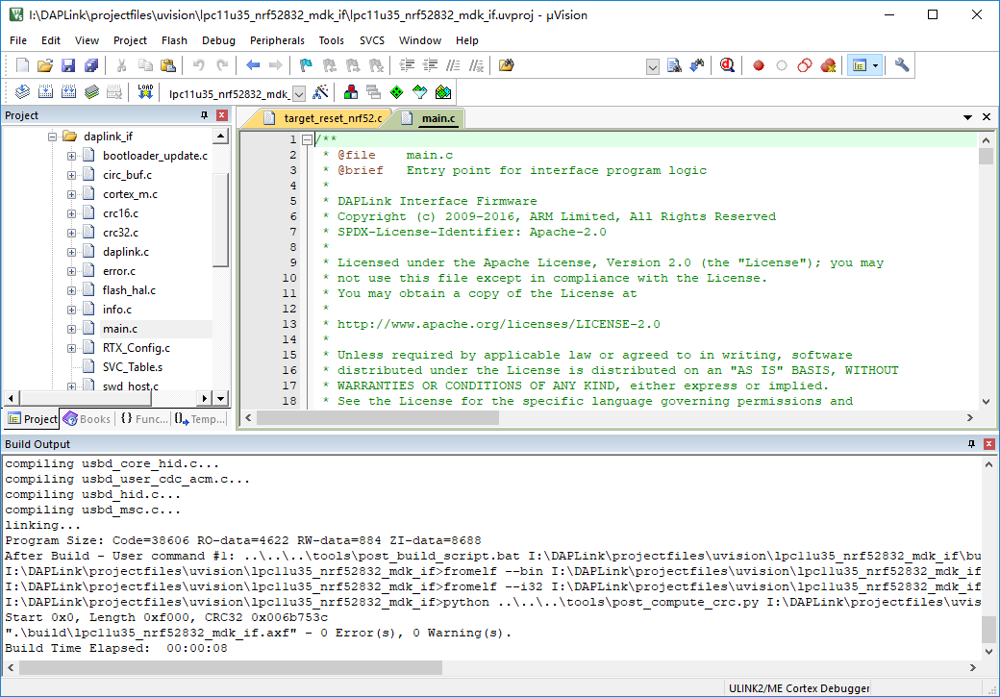

# Arm Mbed DAPLink<br><small>An open-source software project that enables programming and debugging application running on Arm Cortex CPUs.</small>

[](https://github.com/ARMmbed/DAPLink)

## Introduction

Arm Mbed DAPLink is an open-source software project that enables programming and debugging application software on running on Arm Cortex CPUs.  

DAPLink enables developers with drag-and-drop programming, a serial port and CMSIS-DAP based debugging. More features are planned and will show up gradually over time. 

The project is constantly under heavy development by Arm, its partners, numerous hardware vendors and the open-source community around the world. DAPLink has superseded the mbed CMSIS-DAP interface firmware project. You are free to use and contribute. Enjoy!

For more information, please visit [Arm Mbed DAPLink page](https://armmbed.github.io/DAPLink/).

## Distinguishing features

DAPLink enables developers with:

* MSC - drag-n-drop programming flash memory
* CDC - virtual com port for log, trace and terminal emulation
* HID - CMSIS-DAP compliant debug channel
* WEBUSB HID - CMSIS-DAP compliant debug channel

More features are planned and will show up gradually over time. The project is constantly under heavy development by Arm, its partners, numerous hardware vendors and the open-source community around the world. DAPLink has superseded the mbed CMSIS-DAP interface firmware project. You are free to use and contribute. Enjoy!

## Block diagram

Commonly referred to as interface firmware, DAPLink runs on a secondary MCU that is attached to the SWD or JTAG port of the application MCU. This configuration is found on nearly all development boards. It creates a bridge between your development computer and the CPU debug access port.


## How to update DAPLink for nRF5832-MDK?

You can update DAPLink interface firmware by performing the following steps:

1. While holding the board's RESET button, connect it to your computer. The device mounts in its bootloader mode. The drive name should be `CRP DISABLD`.

2. Remove `firmware.bin` from this device's root directory.

3. Download [the latest DAPLink firmware](https://github.com/makerdiary/nrf52832-mdk/tree/master/firmware/daplink). You can find it in the directory `nrf52832-mdk/firmware/daplink` with the name `lpc11u35_nrf52832_mdk_if_crc_xxxx.bin`.

4. Copy the new interface firmware to the drive:

	* Windows - Drag and drop the `.bin` file downloaded before into this directory.

	* macOS - Run the following scripts:

		``` sh
		$ sudo mount -u -w -o sync /Volumes/CRP DISABLD
		$ cp -X <path to interface firmware file> /Volumes/CRP DISABLD/
		```

	* Linux - Run the following scripts:
    
	    ``` sh
	    $ cp <path to interface firmware file> <CRP DISABLD> && sync
	    ```

5. When the file copy operation completes, unplug and replug the board into your computer normally (without holding down the RESET button). Your device now has the new firmware installed and mounts a drive named **DAPLINK**.

6. Check the `DETAILS.TXT` file in **DAPLINK** to verify the `Interface Version`.


## How to build DAPLink?

This tutorial will show you how to create a release build of DAPLink.

### Set up prerequisites
Install the necessary tools listed below. Skip any step where a compatible tool already exists.

* Install [Python 2, 2.7.9 or above](https://www.python.org/downloads/). Add to PATH.
* Install [Git](https://git-scm.com/downloads). Add to PATH.
* Install [Keil MDK-ARM](https://www.keil.com/download/product/), preferably version 5. Set environment variable "UV4" to the absolute path of the UV4 executable if you don't install to the default location. Note that "UV4" is what's used for both MDK versions 4 and 5.
* Install `virtualenv` in your global Python installation eg: `pip install virtualenv`

### Get the sources and create a virtual environment

``` sh
$ git clone https://github.com/ARMmbed/DAPLink
$ cd DAPLink
$ pip install virtualenv
$ virtualenv venv
```

### Update tools and generate project files

!!! note
    This should be done every time you pull new changes.

``` sh
$ ./venv/Scripts/activate
$ pip install -r requirements.txt
$ progen generate -t uvision
$ ./venv/Scripts/deactivate
```

### Compile your project

Change to the `projectfiles/uvision/<your-project>` directory, and open your project using Keil MDK-ARM. Click the `build` icon to build your project. That's it.




## Reference

* [Arm Mbed DAPLink Repo](https://github.com/ARMmbed/DAPLink)

## Create an Issue

Interested in contributing to this project? Want to report a bug? Feel free and click here:

<a href="https://github.com/makerdiary/nrf52832-mdk/issues/new"><button data-md-color-primary="marsala"><i class="fa fa-github"></i> Create an Issue</button></a>

