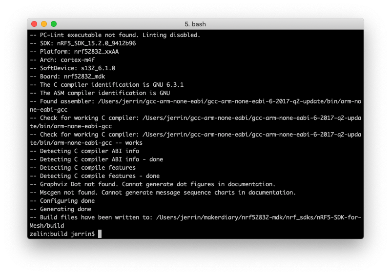
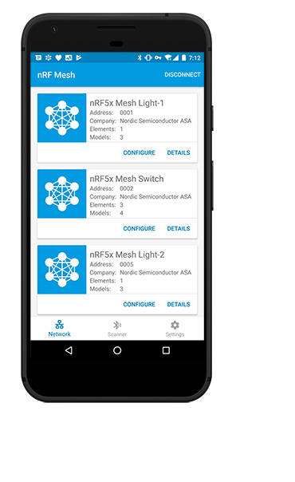

# nRF5 SDK for Mesh <br><small>Software Development Kit for Bluetooth mesh solutions using nRF51 Series and nRF52 Series</small>

[](https://www.nordicsemi.com/Software-and-Tools/Software/nRF5-SDK-for-Mesh)

## Introduction

The nRF5 SDK for Mesh is Nordic Semiconductor's implementation of the [Bluetooth Mesh](https://www.bluetooth.com/bluetooth-technology/topology-options/le-mesh). It allows applications to utilize the features provided by the Bluetooth Mesh when running on Nordic's nRF5 Series chips.

The addition of mesh networking capabilities to Bluetooth Low Energy enables extended range, increases the number of nodes and a many-to-many (m:m) communication topology. In a Bluetooth mesh network every received packet is broadcasted by relays, until the packet is received by the destination node (a so called managed flooding mesh.) A simple, but effective way of spreading information across the mesh network with no single point of failure. The mesh functionality is a significant update and enables new applications for Bluetooth in smart home, lighting, beaconing and asset tracking applications.

You can find detailed information about Bluetooth Mesh in [Bluetooth SIG's introduction to Bluetooth Mesh](https://blog.bluetooth.com/introducing-bluetooth-mesh-networking) and the [Bluetooth Mesh Networking Specifications](https://www.bluetooth.com/specifications/mesh-specifications?_ga=2.18257471.723078495.1501226603-93769939.1480503530).


For more about nRF5 SDK for Mesh, please go to [nordicsemi.com](https://www.nordicsemi.com/en/DocLib/Content/SDK_Doc/Mesh_SDK/v3-0-0/index).

The following documentation sections provide detailed information about the required software toolchains and the process of building the mesh examples.

## Installing the toolchain

To build the example applications, a toolchain based on `CMake` is required. Install instructions are provided for [macOS](#macos), [Windows](windows) and [Linux](linux). 

### macOS

1. Install [CMake](https://cmake.org/) and [Ninja](https://ninja-build.org/) using `brew`:

    ``` sh
    brew install cmake ninja
    ```

2. Download and install the [GNU ARM Embedded Toolchain](https://developer.arm.com/open-source/gnu-toolchain/gnu-rm/downloads). The `6-2017-q2-update` version is recommended. Then make sure to add the path to your toolchain to your OS PATH environment variable.

    ``` sh
    # in ~/.bash_profile, add the following script
    export PATH="<path to install directory>/gcc-arm-none-eabi-6-2017-q2-update/bin:${PATH}"
    ```

3. Verify if the path is set correctly, type the following in your terminal:

    ``` sh
    arm-none-eabi-gcc --version
    ```

4. Install [nRF5x Command Line Tools](https://www.nordicsemi.com/DocLib/Content/User_Guides/nrf5x_cltools/latest/UG/cltools/nrf5x_installation) and [pyOCD](https://github.com/mbedmicro/pyOCD#installing).

### Windows

The easiest way to install the native Windows dependencies is to first install [Chocolatey](https://chocolatey.org/), a package manager for Windows. If you prefer to install dependencies manually, you can also download the required programs from their respective websites.

1. Install **Chocolatey** by following the instructions on the [Chocolatey install](https://chocolatey.org/install) page.

2. Open a command prompt (`cmd.exe`) as an **Administrator**

3. Optionally disable global confirmation to avoid having to confirm installation of individual programs:

    ``` sh
    choco feature enable -n allowGlobalConfirmation
    ```

4. Install **CMake**:

    ``` sh
    choco install cmake --installargs 'ADD_CMAKE_TO_PATH=System'
    ```

5. Install the rest of the tools, and close the Administrator command prompt window when finished.

    ``` sh
    choco install git python ninja
    ```

6. Download and install the [GNU ARM Embedded Toolchain](https://developer.arm.com/open-source/gnu-toolchain/gnu-rm/downloads). The `6-2017-q2-update` version is recommended. Then make sure to add the path to your toolchain to your OS PATH environment variable.

7. Install [nRF5x Command Line Tools](https://www.nordicsemi.com/DocLib/Content/User_Guides/nrf5x_cltools/latest/UG/cltools/nrf5x_installation) and [pyOCD](https://github.com/mbedmicro/pyOCD#installing).

### Linux

This section describes how to set up the development environment on Ubuntu. The steps should be similar for other Linux distributions.

1. Ensure your host system is up to date before proceeding.

    ``` sh
    sudo apt-get update
    sudo apt-get upgrade
    ```

2. Install the following packages using your system’s package manager.

    ``` sh
    sudo apt-get install --no-install-recommends git cmake ninja-build python3-pip
    ```

3. Download and install the [GNU ARM Embedded Toolchain](https://developer.arm.com/open-source/gnu-toolchain/gnu-rm/downloads). The `6-2017-q2-update` version is recommended. Then make sure to add the path to your toolchain to your OS PATH environment variable.

4. Install [nRF5x Command Line Tools](https://www.nordicsemi.com/DocLib/Content/User_Guides/nrf5x_cltools/latest/UG/cltools/nrf5x_installation) and [pyOCD](https://github.com/mbedmicro/pyOCD#installing).

## Clone the Repository

To clone the source code repository from GitHub:

``` sh
git clone ---recursive https://github.com/makerdiary/nrf52832-mdk.git
```

Or if you have already cloned the project, you may update the submodule:

``` sh
git submodule update --init
```

The nRF5 SDK for Mesh now requires the nRF5 SDK to compile. Follow this instruction: [Installing the nRF5 SDK](https://github.com/makerdiary/nrf52832-mdk/tree/master/nrf_sdks#installing-the-nrf5-sdk).


## Building the mesh stack and examples

Now you can try to build the mesh stack and examples. Good practice is to create a `build` folder in the `nrf_sdks/nRF5-SDK-for-Mesh` directory, where all artifacts generated by the Ninja build system are stored:

``` sh
nRF5-SDK-for-Mesh$ mkdir build && cd build
```

Before you can build with Ninja, you must generate the correct build files with CMake.

``` sh
cmake -G Ninja -DTOOLCHAIN=gccarmemb -DPLATFORM=nrf52832_xxAA -DBOARD=nrf52832_mdk -DFLASHER=pyocd ..
```



After the Ninja build files are generated, running `ninja <target>` to build the targets. Here we take `my_light_switch_client` as an example:

``` sh
ninja my_light_switch_client_nrf52832_xxAA_s132_6.1.0
```


## Running the example

To run examples onto your nRF52832-MDK, first connect it to your computer with a USB cable. When your board is detected, run `ninja flash_<your target>` to flash the example:

``` sh
ninja flash_my_light_switch_client_nrf52832_xxAA_s132_6.1.0
```


Run a terminal application(for example [PuTTY](https://www.chiark.greenend.org.uk/~sgtatham/putty/) or [screen](https://www.gnu.org/software/screen/manual/screen.html)) to print the log information:

``` sh
screen /dev/cu.usbmodem1412 115200
```


Flash other several nRF52832-MDK boards with **Server** target:

``` sh
ninja flash_my_light_switch_server_nrf52832_xxAA_s132_6.1.0
```

To build a Bluetooth Mesh Network, you can use the [nRF Mesh mobile app](https://www.nordicsemi.com/Software-and-Tools/Development-Tools/nRF-Mesh)([iOS](https://itunes.apple.com/us/app/nrf-mesh/id1380726771?mt=8) or [Android](https://play.google.com/store/apps/details?id=no.nordicsemi.android.nrfmeshprovisioner)).




## Creating a new target

The easiest way to make a new build target is to:

1. Copy one of the example folders, e.g., `examples/my_beaconing` to `examples/my_app`.

2. Add the folder to the `examples/CMakeLists.txt` with a `add_subdirectory("my_app")` command.

3. Modify the target name in the first line of `examples/my_app/CMakeLists.txt` to `set(target "my_app")`.

4. Generating build files with

    ``` sh
    nRF5-SDK-for-Mesh $ mkdir build && cd build
    build $ cmake -G Ninja -DTOOLCHAIN=gccarmemb -DPLATFORM=nrf52832_xxAA -DBOARD=nrf52832_mdk -DFLASHER=pyocd ..
    ```

5. Build your new target with:

    ``` sh
    ninja my_app
    ```

6. Flash the target:

    ``` sh
    ninja flash_my_app
    ```

## More examples

Over time, more example applications will be added to the repository. You can star or watch the [nrf52832-mdk](https://github.com/makerdiary/nrf52832-mdk) repository to stay up to date.

## Reference

* [nRF5 SDK for Mesh Documentation](https://www.nordicsemi.com/en/DocLib/Content/SDK_Doc/Mesh_SDK/v3-0-0/index)
* [nRF5-SDK-for-Mesh Repository](https://github.com/makerdiary/nRF5-SDK-for-Mesh)
* [Basic Bluetooth Mesh concepts](https://www.nordicsemi.com/en/DocLib/Content/SDK_Doc/Mesh_SDK/v3-0-0/md_doc_introduction_basic_concepts)
* [nRF5 SDK for Mesh architecture](https://www.nordicsemi.com/en/DocLib/Content/SDK_Doc/Mesh_SDK/v3-0-0/md_doc_introduction_basic_architecture)

## Create an Issue

Interested in contributing to this project? Want to report a bug? Feel free and click here:

<a href="https://github.com/makerdiary/nrf52832-mdk/issues/new"><button data-md-color-primary="marsala"><i class="fa fa-github"></i> Create an Issue</button></a>
