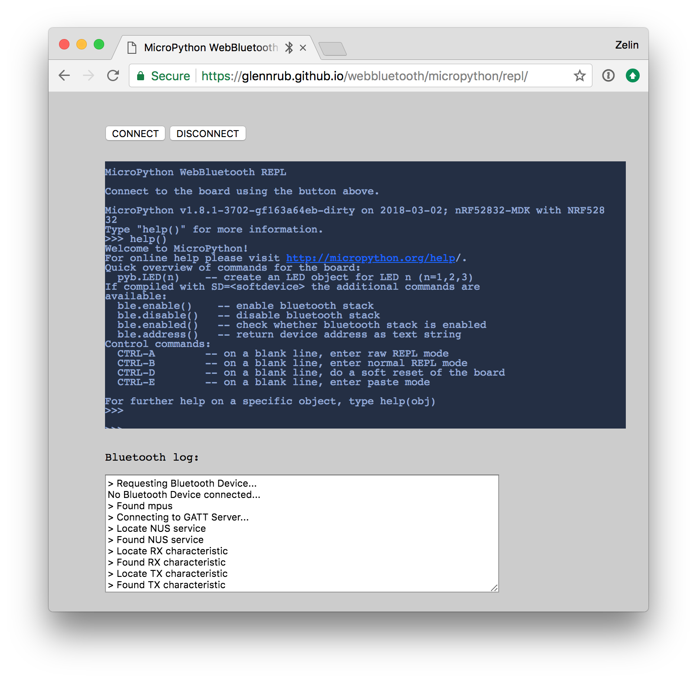

# MicoPython <br><small>A lean and efficient Python implementation for microcontrollers and constrained systems</small>

## Introduction

MicroPython is a lean and efficient implementation of the Python 3 programming language that includes a small subset of the Python standard library and is optimised to run on microcontrollers and in constrained environments.

MicroPython is packed full of advanced features such as an interactive prompt, arbitrary precision integers, closures, list comprehension, generators, exception handling and more. Yet it is compact enough to fit and run within just 256k of code space and 16k of RAM.

MicroPython aims to be as compatible with normal Python as possible to allow you to transfer code with ease from the desktop to a microcontroller or embedded system.

If in doubt, remember the Zen of MicroPython:

``` markdown
Code,
Hack it,
Less is more,
Keep it simple,
Small is beautiful,
Be brave! Break things! Learn and have fun!
Express yourself with MicroPython.
Happy hacking! :-)
```

For more information, please visit the [MicroPython Official Site](http://micropython.org/).

## Getting Started

Follow this tutorial to get started with MicroPython on nRF52832-MDK.

### Flashing MicroPython

Before starting coding, you will need to program nRF52832-MDK with the MicroPython firmware. The MicroPython firmware for nRF52832-MDK is available in the directory `./nrf52832-mdk/firmware/micropython/`.

Connect the nRF52832-MDK to one of your PC's USB host ports. Then drag and drop the hex file into the **DAPLINK** removable drive.

When programming is completed, the unit will be re-detected by the computer. Espruino will run after pressing the RESET button.


### Running your first script

Connect the nRF52832-MDK to your PC and then start a terminal application (for example [PuTTY](https://www.chiark.greenend.org.uk/~sgtatham/putty/) or [screen](https://www.gnu.org/software/screen/manual/screen.html)). Will use the `screen` application here, you will get a MicroPython REPL prompt:

``` sh
$ screen /dev/cu.usbmodem1412 115200
``` 

!!! tip
	REPL stands for Read Evaluate Print Loop. Using the REPL is by far the easiest way to test out your code and run commands.

Once you have a prompt you can start experimenting! Anything you type at the prompt will be executed after you press the Enter key. MicroPython will run the code that you enter and print the result (if there is one). If there is an error with the text that you enter then an error message is printed.

Try typing the following at the prompt:

``` python
>>> print('hello micropython!')
```

Try typing `help()` at the prompt to get more helpful information:


### Blinking an LED

Now you can try to make a real LED blink using the following Python code:

``` python
from machine import Pin
import time

led = Pin('PA22', Pin.OUT)

for i in range(0, 10):
    led.value(1)
    time.sleep_ms(500)
    led.value(0)
    time.sleep_ms(500)

print('Done!')
```

Observe that the GREEN LED is blinking. That's it. Now you've got an idea of how to use MicroPython.

### Next steps

There are many features that were not covered in this tutorial. The best way to learn about them is to read the full documentation of the modules, and to experiment!

Good luck creating your Internet of Things devices!

## How to build MicroPython

This section will show you how to build your own MicroPython firmware.

### Setting up the development environment

The GNU Arm Embedded toolchains is needed to build Espruino.

Download and install the GNU Arm Embedded toolchains. Then make sure to add the path to your toolchain to your OS PATH environment variable:

``` sh
<path to install directory>/gcc-arm-none-eabi-6-2017-q1-update/bin
```

Adding the path makes it possible to run the toolchain executables from any directory using the terminal. To verify that the path is set correctly, type the following in your terminal:

``` sh
$ arm-none-eabi-gcc --version
```

!!! note 
    The latest version of GNU Arm Embedded toolchain maybe not work fine, but you can just have a try.

### Compiling and flashing MicroPython

Prerequisite steps for building the nrf port:

``` sh
$ git clone https://github.com/makerdiary/micropython.git
$ cd micropython
$ git submodule update --init
$ make -C mpy-cross
```

Change directory to `nrf` and prepare the bluetooth folder by downloading Bluetooth LE stacks and headers:

``` sh
micropython$ cd nrf
nrf$ ./drivers/bluetooth/download_ble_stack.sh
```

After the Bluetooth stacks has been downloaded, connect nRF52832-MDK to your current PC. Now you can compile the target with the following command:

``` sh
$ make BOARD=nrf52832_mdk SD=s132 sd FLASHER=pyocd
```

!!! note 
    The `make sd` will trigger a flash of the bluetooth stack before that application is flashed. Set `FLASHER` to `pyocd` if DAPLink is available.


### Bluetooth LE REPL

The nrf port also implements a BLE REPL driver. This feature is disabled by default, as it will deactivate the UART REPL when activated. As nRF52832 only have one UART, using the BLE REPL free's the UART instance such that it can be used as a general UART peripheral not bound to REPL.

The configuration can be enabled by editing the `bluetooth_conf.h` and set `MICROPY_PY_BLE_NUS` to `1`.

WebBluetooth mode can also be configured by editing `bluetooth_conf.h` and set `BLUETOOTH_WEBBLUETOOTH_REPL` to `1`. This will alternate advertisement between Eddystone URL and regular connectable advertisement. The Eddystone URL will point the phone or PC to download [WebBluetooth REPL](https://glennrub.github.io/webbluetooth/micropython/repl/) (experimental), which subsequently can be used to connect to the Bluetooth REPL from the PC or Phone browser.



### Status

The nrf port is **NOT** stable and some APIs may be changed over time. So, be brave! Break things! Learn and have fun! 

Happy hacking! :-)

## Reference

* [MicroPython Official site](http://micropython.org/)
* [MicroPython Documentation](http://docs.micropython.org/en/latest/pyboard/index.html)
* [MicroPython Official Repo](https://github.com/micropython/micropython)
* [MicroPython forked by makerdiary](https://github.com/makerdiary/micropython)

## Any Issue ?

Interested in contributing to this project? Want to report a bug? Feel free and click here:

<a href="https://github.com/makerdiary/nrf52832-mdk/issues/new"><button data-md-color-primary="indigo"><i class="fa fa-github"></i> New Issue</button></a>

<a href="https://join.slack.com/t/makerdiary/shared_invite/enQtMzIxNTA4MjkwMjc2LTM5MzcyNDhjYjI3YjEwOWE1YzM3YmE0YWEzNGNkNDU3NmE5M2M0MWYyM2QzZTFkNzQ2YjdmMWJlZjIwYmQwMDk"><button data-md-color-primary="red"><i class="fa fa-slack"></i> Add to Slack</button></a>
