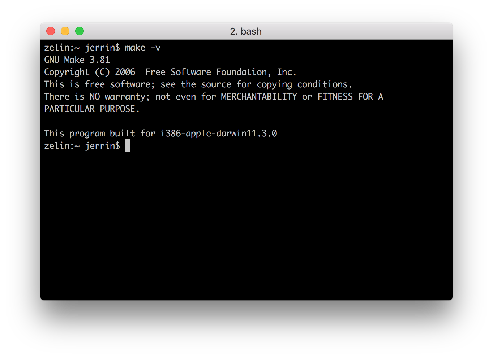

# nRF5 SDK <br><small>Software Development Kit for nRF51 and nRF52 Series</small>

[](https://www.nordicsemi.com/Software-and-Tools/Software/nRF5-SDK)

## Introduction

The nRF5 SDK provides a rich developing environment for nRF5 Series devices by including a broad selection of drivers, libraries, examples for peripherals, SoftDevices, and proprietary radio protocols.

The SDK is delivered as a plain .zip-archive, which makes it easy to install as well as giving you the freedom to choose the IDE and compiler of your choice.

We provide example applications that you can run on your nRF52832-MDK to ensure that everything is set up correctly. After these tests, you can use the examples as starting point to develop your own applications.

Before we begin, we need to install some software components to build our example applications. Here we recommend GNU Arm Embedded Toolchains as they are free and open-source.

## Installing GNU Arm Embedded Toolchain

The GNU Arm Embedded toolchains are integrated and validated packages featuring the Arm Embedded GCC compiler, libraries and other GNU tools necessary for bare-metal software development on devices based on the Arm Cortex-M and Cortex-R processors. The toolchains are available for cross-compilation on Microsoft Windows, Linux and macOS host operating systems.

These toolchains are based on [Free Software Foundation](https://www.gnu.org/home.en.html)'s (FSF) GNU Open source tools and newlib.

The pre-built GNU Arm Embedded Toolchain can be downloaded using the following link: 

<a href="https://developer.arm.com/open-source/gnu-toolchain/gnu-rm/downloads"><button data-md-color-primary="marsala">Download</button></a>

Download and install the latest version. Then make sure to add the path to your toolchain to your OS PATH environment variable:


``` sh
<path to install directory>/gcc-arm-none-eabi-6-2017-q2-update/bin
```

Adding the path makes it possible to run the toolchain executables from any directory using the terminal. To verify that the path is set correctly, type the following in your terminal:

``` sh
$ arm-none-eabi-gcc --version
```


## Installing GNU make

Now with the toolchain installed we can build object files from source code, but to build projects based on makefiles, which can be seen as a recipes for the builds, we need to have [GNU make](https://www.gnu.org/software/make/) installed on the system.

On Windows the easiest way to install the dependencies is to use the [MSYS2](http://www.msys2.org/). You can do so by performing the following steps:

<a href="http://www.msys2.org/"><button data-md-color-primary="marsala">Download</button></a>

1. Download and run the installer - "x86_64" for 64-bit, "i686" for 32-bit Windows.

2. Update the package database and core system packages with:

	``` sh
	$ pacman -Syu
	```

3. If needed, close MSYS2, run it again from Start menu. Update the rest with:

	``` sh
	$ pacman -Su
	```

4. Install dependencies:

	``` sh
	$ pacman -S git make python2
	```


Linux and macOS already have the necessary shell commands, but GNU make may not be a part of the standard distro. Call `make -v` from the terminal to check whether it is installed or not. GNU make would need to be installed if it's not recognized as a command.

GNU make is bundled with Xcode tools if working on macOS.

On Linux it may be different ways to obtain GNU make depending on your distro, if not installed already. On Ubuntu you can get by entering this command:

``` sh
$ sudo apt-get install build-essential checkinstall
```



## Installing the nRF5 SDK

Download the SDK file `nRF5_SDK_x.x.x_xxxxxxx` (for example, `nRF5_SDK_15.2.0_9412b96`) from [www.nordicsemi.com](https://www.nordicsemi.com/Software-and-Tools/Software/nRF5-SDK).

The latest version is `15.2.0`, it can be downloaded directly here:

<a href="https://www.nordicsemi.com/Software-and-Tools/Software/nRF5-SDK/Download#infotabs"><button data-md-color-primary="marsala">Download</button></a>

Extract the zip file to the `nrf52832-mdk` repository. This should give you the following folder structure:

``` sh
./nrf52832-mdk/
├── LICENSE
├── README.md
├── config
├── docs
├── firmware
├── examples
├── mkdocs.yml
├── nrf_sdks
│   └── nRF5_SDK_v15.2.0_9412b96
└── tools
```

To build an example application you first need to set the toolchain path in `makefile.windows` or `makefile.posix` depending on platform you are using. That is, the `.posix` should be edited if your are working on either Linux or macOS. These files are located in:

``` sh
<SDK>/components/toolchain/gcc
```

Open the file in a text editor ([Sublime](https://www.sublimetext.com/) is recommended), and make sure that the `GNU_INSTALL_ROOT` variable is pointing to your GNU Arm Embedded Toolchain install directory.

``` sh
GNU_INSTALL_ROOT ?= $(HOME)/gcc-arm-none-eabi/gcc-arm-none-eabi-6-2017-q2-update/bin/
GNU_VERSION ?= 6.3.1
GNU_PREFIX ?= arm-none-eabi
```

## Compiling and running blinky example

Now you can try to build one of the examples. Will use the `blinky` example here to keep it simple.

Open terminal and change directory to:

``` sh
$ cd ./nrf52832-mdk/examples/nrf5-sdk/blinky/armgcc/
```

Connect the nRF52832-MDK to one of your PC's USB host ports. Compile and program the example:

``` sh
$ make flash
```

Observe that the LEDs are blinking:


## Running examples that use a SoftDevice

Before you can run more advanced examples that use *Bluetooth* or *ANT*, you must program the SoftDevice on the board.

The SoftDevice binary is located in folder `components/softdevice/SoftDevice/hex` in the SDK, where SoftDevice is the name of the SoftDevice. You can also download SoftDevices from [nordicsemi.com](https://www.nordicsemi.com/Software-and-Tools/Software/nRF5-SDK/Download#infotabs).

The easiest way to program the SoftDevice is using the GCC makefile of an example:

1. Open a command prompt in the folder that contains the makefile of an example. The example must require a SoftDevice. For example, the `ble_app_blinky` example.

2. Run the following command:

	``` sh
	# this will program SoftDevice alone
	$ make flash_softdevice
	```

	Or 

	``` sh
	# this will program the application with SoftDevice
	$ make flash_all
	```

## More examples

Over time, more example applications will be added to the repository. You can star or watch the [nrf52832-mdk](https://github.com/makerdiary/nrf52832-mdk) repository to stay up to date.

## Reference

* [Nordic nRF5 SDK](https://www.nordicsemi.com/Software-and-Tools/Software/nRF5-SDK)

* [Nordic Documentation Library](https://www.nordicsemi.com/DocLib)

* [makerdiary/nrf52832-mdk](https://github.com/makerdiary/nrf52832-mdk)

* [GNU Arm Embedded Toolchain](https://developer.arm.com/open-source/gnu-toolchain/gnu-rm)

## Create an Issue

Interested in contributing to this project? Want to report a bug? Feel free and click here:

<a href="https://github.com/makerdiary/nrf52832-mdk/issues/new"><button data-md-color-primary="marsala"><i class="fa fa-github"></i> Create an Issue</button></a>


