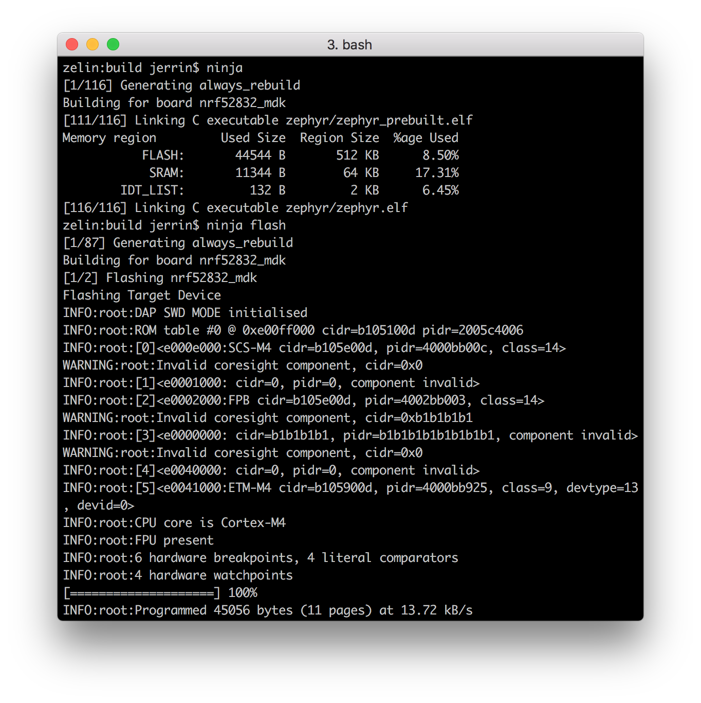

# Zephyr <br><small>A scalable RTOS supporting multiple hardware architectures, optimized for resource constrained devices, and built with security in mind</small>

[](https://www.zephyrproject.org/)

## Introduction

The Zephyr OS is based on a small-footprint kernel designed for use on resource-constrained systems: from simple embedded environmental sensors and LED wearables to sophisticated smart watches and IoT wireless gateways.

The Zephyr kernel supports multiple architectures, including ARM Cortex-M, Intel x86, ARC, NIOS II, Tensilica Xtensa, and RISC-V. 

## Distinguishing Features

The Zephyr kernel offers a number of features that distinguish it from other small-footprint OSes:

* Single address-space
* Highly configurable / Modular for flexibility
* Cross Architecture
* Compile-time resource definition
* Minimal and Configurable error checking
* Memory Protection
* Native Networking Stack supporting multiple protocols
* Native Linux, macOS, and Windows Development
* Extensive suite of services

For more details, please visit [Zephyr Project](https://www.zephyrproject.org/) site.

## Getting Started

### Checking out the repository

Clone the [Zephyr Project](https://github.com/zephyrproject-rtos/zephyr) repository on GitHub or download it as a zip package and put its contents to your working directory.

``` sh
$ git clone https://github.com/zephyrproject-rtos/zephyr.git
```

### Setting up the development environment

The Zephyr project uses [CMake](https://cmake.org/) as a tool for managing the building of the project. CMake is able to generate build files in different formats (also known as “generators”), and the following ones are currently supported by Zephyr:

* `make`: Supported on UNIX-like platforms (Linux, macOS).
* `ninja`: Supported on all platforms.

The setup process for the development environment depends on your operating system. Please choose your host operating system. The setup instructions for each operating system walk you through how to set up the development environment.

#### Windows

The easiest way to install the dependencies natively on Microsoft Windows is to use the Chocolatey package manager ([Chocolatey website](https://chocolatey.org/)). 

1. Install Chocolatey by following the instructions on the [Chocolatey install](https://chocolatey.org/install) website.

2. Open a Command Prompt (cmd.exe) as an **Administrator**.

3. Optionally disable global confirmation to avoid having to add -y to all commands:

	``` sh
	$ choco feature enable -n allowGlobalConfirmation
	```

4. Install CMake:

	``` sh
	$ choco install cmake --installargs 'ADD_CMAKE_TO_PATH=System'
	```

5. Install the rest of the tools:

	``` sh
	$ choco install git python ninja dtc-msys2 gperf
	```

6. Close the Command Prompt window.

7. Open a Command Prompt (cmd.exe) as a regular user.

8. Install the required Python modules:

	``` sh
	$ cd ./zephyr
	$ pip install --user -r scripts/requirements.txt
	$ pip2 install --user -r scripts/py2-requirements.txt
	```

9. Download and install the [GNU Arm Embedded Toolchain](https://developer.arm.com/open-source/gnu-toolchain/gnu-rm/downloads) (install to `c:\gccarmemb`).

10. Within the Command Prompt, set up environment variables for the installed tools and for the Zephyr environment:

	``` sh
	$ set ZEPHYR_TOOLCHAIN_VARIANT=gccarmemb
	$ set GCCARMEMB_TOOLCHAIN_PATH=c:\gccarmemb
	```

#### macOS

First, install the *Homebrew* (The missing package manager for macOS). Homebrew is a free and open-source software package management system that simplifies the installation of software on Apple’s macOS operating system.

To install Homebrew, visit the [Homebrew site](http://brew.sh/) and follow the installation instructions on the site.

After Homebrew was successfully installed, install the following tools using the brew command line:

``` sh
$ brew install cmake ninja dfu-util doxygen qemu dtc python3 gperf
$ curl -O 'https://bootstrap.pypa.io/get-pip.py'
$ ./get-pip.py
$ rm get-pip.py
$ cd ~/zephyr   # or to the folder where you cloned the zephyr repo
$ pip3 install --user -r scripts/requirements.txt
$ pip2 install --user -r scripts/py2-requirements.txt
```

Download and install the [GNU Arm Embedded Toolchain](https://developer.arm.com/open-source/gnu-toolchain/gnu-rm/downloads). Then make sure to add the path to your toolchain to your OS PATH environment variable:

``` sh
# add the following scripts to ~/.bash_profile 
export GCCARMEMB_TOOLCHAIN_PATH="<path to install directory>/gcc-arm-none-eabi-6-2017-q2-update"
export ZEPHYR_GCC_VARIANT=gccarmemb
```

#### Linux

Before proceeding with the build, ensure your OS is up to date. On Ubuntu, you’ll first need to update the local database list of available packages before upgrading:

``` sh
$ sudo apt-get update
$ sudo apt-get upgrade
```

Install the required packages in a Ubuntu host system with:

``` sh
$ sudo apt-get install --no-install-recommends git cmake ninja-build gperf \
  ccache doxygen dfu-util device-tree-compiler \
  python3-ply python3-pip python3-setuptools xz-utils file make gcc-multilib \
  autoconf automake libtool
```

Install additional packages required for development with Zephyr:

``` sh
$ cd ~/zephyr  # or to your directory where zephyr is cloned
$ pip3 install --user -r scripts/requirements.txt
$ pip2 install --user -r scripts/py2-requirements.txt
```

Download and install the [GNU Arm Embedded Toolchain](https://developer.arm.com/open-source/gnu-toolchain/gnu-rm/downloads). Then make sure to add the path to your toolchain to your OS PATH environment variable:

``` sh
# add the following scripts to ~/.bash_profile 
export GCCARMEMB_TOOLCHAIN_PATH="<path to install directory>/gcc-arm-none-eabi-6-2017-q2-update"
export ZEPHYR_GCC_VARIANT=gccarmemb
```

### Adding support for nRF52832-MDK

To add support for nRF52832-MDK, you must add the board support files. This should give you the following folder structure:

``` sh
.zephyr/boards/arm/nrf52832_mdk
├── Kconfig
├── Kconfig.board
├── Kconfig.defconfig
├── board.cmake
├── board.h
├── nrf52832_mdk.dts
├── nrf52832_mdk.yaml
└── nrf52832_mdk_defconfig
```

You can checkout the patch from [makerdiary/zephyr](https://github.com/makerdiary/zephyr):

``` sh
$ cd <zephyr git clone location>
$ git remote add makerdiary https://github.com/makerdiary/zephyr.git
$ git pull makerdiary master
```

### Compiling and running an example

Now you can try to build one of the examples. Will use the `hello_world` example here to keep it simple.

Source `zephyr-env.sh` wherever you have cloned the Zephyr Git repository:

``` sh
$ unset ZEPHYR_SDK_INSTALL_DIR
$ cd <zephyr git clone location>
$ source zephyr-env.sh
```

Create a `build` folder in the example directory, where all artifacts generated by the Ninja build system are stored, such as:

``` sh
$ cd nrf52832-mdk/examples/zephyr/hello_world/
$ mkdir build && cd build

build$ cmake -GNinja -DBOARD=nrf52832_mdk ..
build$ ninja
build$ ninja flash
```



Check the board output from serial port, you will see the following messages:

``` sh
***** Booting Zephyr OS 1.12.0-rc3 *****
Hello World! arm
```

That's it! You can also try other examples in the path `nrf52832-mdk/examples/zephyr/`.

## More examples

Over time, more example applications will be added to the repository. You can star or watch the [nrf52832-mdk](https://github.com/makerdiary/nrf52832-mdk) repository to stay up to date.

## Reference

* [Zephyr Project site](https://www.zephyrproject.org/)
* [Zephyr Project Documentation](http://docs.zephyrproject.org/index.html)
* [zephyrproject-rtos/zephyr repository](https://github.com/zephyrproject-rtos/zephyr)

## Create an Issue

Interested in contributing to this project? Want to report a bug? Feel free and click here:

<a href="https://github.com/makerdiary/nrf52832-mdk/issues/new"><button data-md-color-primary="marsala"><i class="fa fa-github"></i> Create an Issue</button></a>


